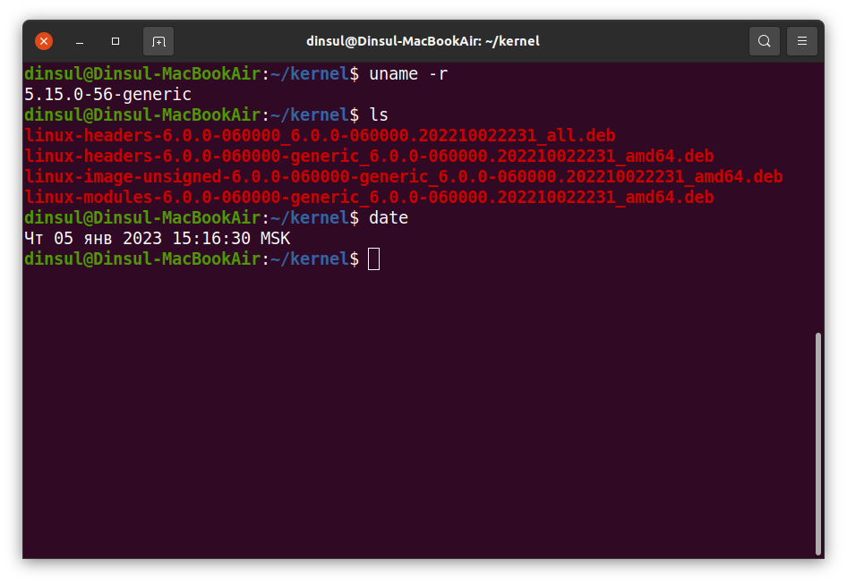
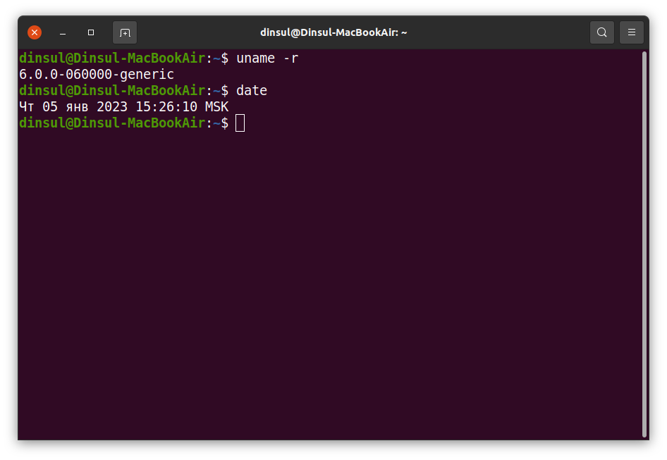

# otus_linux-hw_01

1. провёл обновление ядра на рабочей машине

    

    

1. провёл обновление на виртуальной машине с использованием vagrant

    [Журнал действий](kernel_update_vagrant.log)

1. настроил Packer на создание виртуальной машины с ОС centos 8 и обнавлением ядра до актуальной версии (сейчас 6.1.6)
